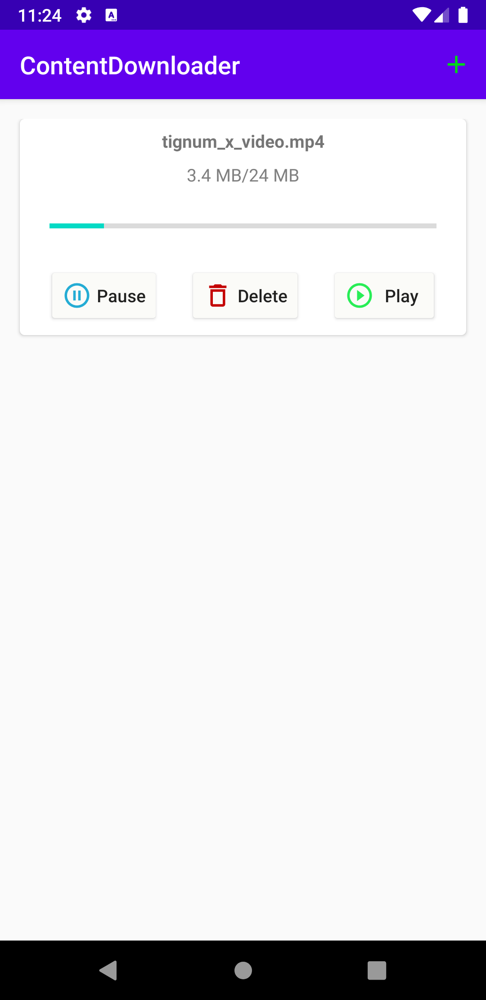

# ContentDownloader

### Summary

:pushpin: **Download Content Screen**
- An empty screen will be visible when application is launched.
- By using plus icon (:heavy_plus_sign:) on the right top corner, a new url can be added to list.
- To trigger the download action, click download button of the related item.
- To pause the process, click pause button.
- To delete the content, click delete button.
- To play the content, click play button.

  

---

:pushpin: **Video Player Screen**
- The screen will be rotated to landscape mode automatically to provide a better experience.

### Implementation Details
:heavy_check_mark: 100% Kotlin  
:heavy_check_mark: MVVM architecture   
:heavy_check_mark: Hilt for dependency injection    
:heavy_check_mark: OkHttp & Coroutines for network operations  
:heavy_check_mark: Room database for offline storage  
:heavy_check_mark: Covered by Unit & UI Tests  
